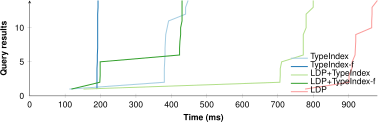
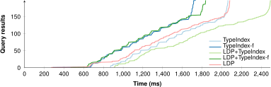
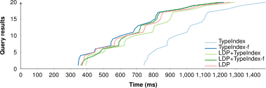

## Additional Experimental Results
{:#appendix-evaluation}

### Aggregated Results Complex Queries

 shows the aggregated query results for all complex queries.

<figure id="results-queries-complex" class="table" markdown="1" class="table-smaller-font">

|  | $$\overline{t}$$ | $$\tilde{t}$$ | $$\overline{t}_1$$ | $$\tilde{t}_1$$ | $$\overline{req}$$ | $$\sum ans$$ | $$\overline{cor}$$ | $$\sum to$$ |
| --- | ---: | ---: | ---: | ---: | ---: | ---: | ---: | ---: |
| cnone-base | 13,128 | 2 | N/A | N/A | 11 | 0.00 | 0.00% | 1 |
| **cmatch-base** | **16,574** | **2** | **3** | **2** | **1,619** | **0.50** | **2.50%** | **4** |
| call-base | 39,648 | 0 | N/A | N/A | 0 | 0.00 | 0.00% | 12 |
| cnone-idx | 19,478 | 0 | N/A | N/A | 262 | 0.00 | 0.00% | 4 |
| cmatch-idx | 37,182 | 0 | N/A | N/A | 71 | 0.00 | 0.00% | 11 |
| call-idx | 39,881 | 0 | N/A | N/A | 0 | 0.00 | 0.00% | 12 |
| cnone-idx-filt | 17,472 | 0 | N/A | N/A | 264 | 0.00 | 0.00% | 4 |
| cmatch-idx-filt | 37,179 | 0 | N/A | N/A | 71 | 0.00 | 0.00% | 11 |
| call-idx-filt | 40,095 | 0 | N/A | N/A | 0 | 0.00 | 0.00% | 12 |
| cnone-ldp | 18,802 | 0 | N/A | N/A | 344 | 0.00 | 0.00% | 4 |
| cmatch-ldp | 38,911 | 0 | N/A | N/A | 81 | 0.00 | 0.00% | 11 |
| call-ldp | 40,056 | 0 | N/A | N/A | 0 | 0.00 | 0.00% | 12 |
| cnone-ldp-idx | 19,656 | 0 | N/A | N/A | 400 | 0.00 | 0.00% | 4 |
| cmatch-ldp-idx | 38,100 | 0 | N/A | N/A | 87 | 0.00 | 0.00% | 11 |
| call-ldp-idx | 40,067 | 0 | N/A | N/A | 0 | 0.00 | 0.00% | 12 |
| cnone-ldp-idx-filt | 19,528 | 0 | N/A | N/A | 389 | 0.00 | 0.00% | 5 |
| cmatch-ldp-idx-filt | 37,676 | 0 | N/A | N/A | 110 | 0.00 | 0.00% | 11 |
| call-ldp-idx-filt | 40,044 | 0 | N/A | N/A | 0 | 0.00 | 0.00% | 12 |

<figcaption markdown="block">
Aggregated results for the different combinations across all 12 **complex** queries.
</figcaption>
</figure>

### Winning Combinations for Discover Queries

 shows an overview of the number of queries where each approach achieves the lowest execution time per query.

<figure id="results-queries-cmatch-wins" class="table" markdown="1" class="table-smaller-font">

|  | idx | idx-filt | ldp | ldp-idx | ldp-idx-filt |
| --- | ---: | ---: | ---: | ---: | ---: |
| Wins | 10 | 15 | 5 | 5 | 0 |

<figcaption markdown="block">
The number of queries each approach achieves the lowest query execution time for across all **cMatch-based** approaches over all 8 **discover** queries with 5 instantiations.
A win for a certain approach is only considered if the results are correct for this query.
Five queries are missing due to no approaches achieving correct results.
</figcaption>
</figure>

### Diefficiency Plots

 and  show the query result arrival times for D1 and D2 respectively
with different combinations of data vault discovery with cMatch.
Since D1 specifically queries for resources of the type Post, it can very selectively make use of the Post entry within the type index,
which makes the filtered type index approach faster than the non-filtered approach.
D2 targets both resources of type Comment and Post, which means that it has to make use of both entries within the type index,
which causes the performance difference between the filtered and non-filtered type index approach to be negligeable.

 shows the query result arrival times for D5,
which is a query that does not specifically target resources of certain types.
This means that the type index leads to no significant performance benefit.

<figure id="figure-querytimes_d1-3">

<figcaption markdown="block">
Query result arrival times for D1 with different combinations of data vault discovery with cMatch.
</figcaption>
</figure>

<figure id="figure-querytimes_d2-3">

<figcaption markdown="block">
Query result arrival times for D2 with different combinations of data vault discovery with cMatch.
</figcaption>
</figure>

<figure id="figure-querytimes_d5-4">

<figcaption markdown="block">
Query result arrival times for D5 with different combinations of data vault discovery with cMatch.
</figcaption>
</figure>