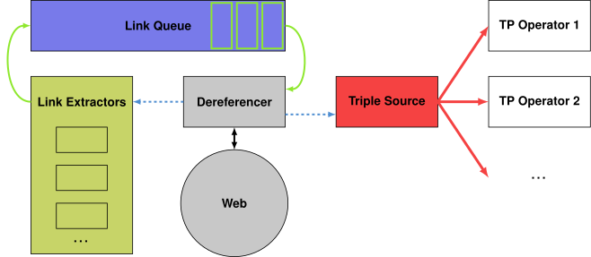

## Approach
{:#approach}

In this section, we introduce algorithms for handling the structural properties discussed in .
We start by discussing the preliminaries of the formalities we will introduce.
Next, we discuss the pipeline-based link queue approach.
Then, we discuss two novel discovery approaches for LTQP.
Finally, we discuss their implementations.

### Formal preliminaries

This section summarizes the semantics of [SPARQL query execution](cite:cites sparqlsemantics)
and [LTQP](cite:cites linktraversalfoundations, guidedlinktraversal) that we build upon.

The infinite set of *RDF triples* is formalized as $$ \mathcal{T} = (\mathcal{I} \cup \mathcal{B}) \times \mathcal{I} \times (\mathcal{I} \cup \mathcal{B} \cup \mathcal{L}) $$,
where $$\mathcal{I}$$, $$\mathcal{B}$$, and $$\mathcal{L}$$ respectively denote the disjoint, infinite sets of IRIs, blank nodes, and literals.
Furthermore, $$\mathcal{V}$$ is the infinite set of all variables that is disjoint from $$\mathcal{I}$$, $$\mathcal{B}$$, and $$\mathcal{L}$$.
A tuple $$tp \in (\mathcal{V} \cup \mathcal{I}) \times (\mathcal{V} \cup \mathcal{I}) \times (\mathcal{V} \cup \mathcal{I} \cup \mathcal{L})$$ is called a *triple pattern*.
A finite set of these triple pattern is called a *basic graph pattern* (BGP).
More complex SPARQL query operators exist,
but since BGPs form the foundational building block of a SPARQL query,
we only consider BGPs for the remainder of this work.
The query results of a SPARQL query $$P$$ over a set of RDF triples $$G$$ are called *solution mappings*,
which are denoted by $$[[P]]_G$$, consisting of partial mappings $$\mu : \mathcal{V} \rightarrow (\mathcal{I} \cup \mathcal{B}\cup \mathcal{L})$$.
An RDF triple $$t$$ *matches* a triple pattern $$tp$$ if $$\exists \mu : t = \mu[tp]$$, where $$\mu[tp]$$ is the triple pattern that is obtained by replacing all variables from $$\mu$$ in $$tp$$.

Formally, the reachability approaches that were discussed in 
that define which links should be followed during link traversal are usually captured as [*reachability criteria*](cite:cites linktraversalfoundations).
However, since this formalization is restricted to considering either all or no URIs within specific data triples,
it is not expressive enough for only following specific URIs within only subject, predicate, or object in data triples.
Therefore, we formalize new reachability criteria in this work *source selectors*
within the [subweb specification formalization](cite:cites guidedlinktraversal) that _is_ expressive enough to capture this.
Within this formalization, a source selector $$\sigma$$ is defined as $$\sigma : \mathcal{W} \rightarrow 2^{\mathcal{I}}$$,
where $$\mathcal{W}$$ is a Web of Linked Data.
The Web of Linked Data $$\mathcal{W}$$ is a tuple $$\langle D, data, adoc \rangle$$,
where $$D$$ is a set of documents, $$data$$ a function from $$D$$ to $$2^\mathcal{T}$$
such that $$data(d)$$ is finite for each $$d \in D$$,
and $$adoc$$ a partial dereferencing function from $$\mathcal{U}$$ to $$D$$.

Based on these definitions, we define the set of all Solid data vaults as $$\Upsilon$$,
where each Solid data vault $$\upsilon \in \Upsilon$$ is defined as a set of triples, where $$triples(\upsilon) \subseteq \mathcal{T}$$.
For a Solid data vault $$\upsilon_{LDP}$$ exposed through the LDP interface,
the triples contained in such a Solid vault are captured in different documents $$D_{\upsilon} \subseteq D$$.
Hereby, $$triples(\upsilon_{LDP}) = \{ t \mid \forall d \in D_{\upsilon} \land t \in data(d) \}$$.

### Pipeline-based link queue

To execute a query,
our approach builds upon the heuristics-based [zero-knowledge query planning technique](cite:cites zeroknowldgequeryplanning)
to construct a logical query plan ahead of query execution.
This resulting plan produces a tree of logical query operators representing in what order the query should be executed.
To execute this plan, the logical operators are executed by specific physical operators.

Our physical query execution builds upon the [iterator-based pipeline approach](cite:cites linktraversalpipeline),
which is [the most popular among LTQP implementations](cite:cites squin, sihjoin, diamondrete).
This involves considering the execution plan as a [pipeline](cite:cites pipelining) of iterator-based physical operators,
through which intermediary results can flow through these chained operators to produce results in a pull-based manner.

Instead of [letting operators trigger the dereferencing of URIs](cite:cites linktraversalpipeline),
we follow a [link queue-based approach](cite:cites linktraversaloptimization).
The architecture of this approach is visualized in .
Concretely, we consider a continuously growing *triple source* as the basis of the pipeline tree,
which is able to produce a (possibly infinite) stream of RDF triples.
This triple source is fed triples originating from a loop consisting of the *link queue*, *dereferencer*, and a set of *link extractors*.
The link queue accepts links from a set of link extraction components,
which are invoked for every document that has been dereferenced by the dereferencer.
The dereferenced documents containing triples are also sent to the continuously growing triple source.
This link queue is initialized with a set of seed URIs,
and the dereferencer continuously dereferences the URIs in the queue until it is empty.
Since the link extractors are invoked after every dereference operation,
this link queue may virtually become infinitely long.

This link queue and link extractor approach is generic enough to implement
[the majority of methods](cite:cites linktraversalpipeline, linktraversalfoundations, linktraversalpropertypaths, guidedlinktraversal, linktraversaloptimization)
for determining and prioritizing links that need to be followed.
For example, one link extractor may extract all objects of each RDF triple matching the `rdfs:seeAlso` predicate,
while another link extractor may extract all components of each triple that matches with a triple pattern within the query.
Optionally, operators within the query pipeline may also push links directly into the link queue,
which may enable implementation of [context-based reachability semantics](cite:cites linktraversalpropertypaths).
Link extractors only consider URIs as links,
and thereby ignore any matches for blank nodes and literals.

The triple source is connected to all [tuple-producing SPARQL operators](cite:cites sparqlsemantics) in the leaves of the query plan,
such as triple patterns and property path operators,
into which a stream of triples is sent.
The queue indexes all triples locally, to ensure that a triple pattern operator
that is executed later in the execution process does not miss any triples.

<figure id="figure-link-queue">

<figcaption markdown="block">
Link queue, dereferencer and link extractors feeding triples into a triple source,
which produces a continuous stream of triples to tuple-producing operators
in a pipelined query execution.
</figcaption>
</figure>

### Discovery of data vault

So far, no discovery methods exist
that can handle the traversal of a Solid data vaults as described in .
Hence, we introduce an approach in this section.

#### Intuitive description

In order to achieve link traversal within a vault,
we assume that the WebID document is available as seed URI,
or that this WebID document has been discovered through some other reachability approach.
As discussed in , the root of a vault can be discovered from a WebID document
by dereferencing the object URI referred to by the `pim:storage` predicate.
Next, all resources within this vault can be discovered by recursively following `ldp:contains` links from the root LDP container.

Note that we only consider triples for the `pim:storage` and `ldp:contains` predicates
that have the current document URI as subject.
If subjects contain fragment identifiers, we only consider them if the current document URI had this fragment identifier as well before it was dereferenced.
For example, if a WebID with fragment identifier `#me` was discovered,
then we only consider triples with the document URI + `#me` as subject.

#### Formal description

We can formalize our discovery approach for the roots of data vaults as the following source selector starting from a given WebID with URI $$i$$:

$$
\sigma_{\text{SolidVault}}(W) = \{ o \mid \langle i \text{ pim:storage } o \rangle \in data(adoc(i))\}
$$

Disjunctively coupled with this source selector $$\sigma_{\text{SolidVault}}$$,
we can formalize the following source selector that can recursively traverse an LDP container:

$$
\sigma_{\text{LdpContainer}}(W) = \{ o \mid \forall s : \langle s \text{ ldp:contains } o \rangle \in data(adoc(s)\}
$$

<!--A reachability criterion $$c$$ is defined as a total computable function $$c : \mathcal{T} \times \mathcal{I} \times \mathcal{B} \rightarrow \{ \text{true}, \text{false} \}$$,
where $$\mathcal{T}$$ is the infinite set of all possible data triples,
$$\mathcal{I}$$ is the infinite set of all document URIs.
and $$\mathcal{B}$$ is the infinite set of all possible query patterns.

We can formalize our discovery approach for data vaults as the following reachability criterion:

$$
c_{\text{SolidVault}}(t, id, B) = \left\{ \begin{array}{ll}
        \text{true}  & \text{if}\ t\ \text{matches}\ (id\ \text{pim:storage}\ ?\text{var})\\
                     & \lor\ t\ \text{matches}\ (id\ \text{ldp:contains}\ ?\text{var}),\\
        \text{false} & \text{else}.\end{array} \right.
$$
-->

### Discovery of type index

As discussed in , the type index provides a way to discover resources in a data vault by RDF classes.
In this section, we introduce a discovery method that follows links in the type index.
This discovery method contains an optional filter component that is able to only following those type index links that match with a class mentioned in the query.

#### Intuitive description

As before, we consider a WebID document as a starting point.
From this document, we follow the `solid:publicTypeIndex` and `solid:privateTypeIndex` links.
For each discovered type index, we consider all `solid:TypeRegistration` resources,
and follow their `solid:instance` and `solid:instanceContainer` links.

As an optimization, we can also take into the type information within the type registrations within the type index,
to only follow those links for classes that are of interest to the current query.
Concretely, this involves considering the objects referred to by `solid:forClass` on each type registration.
To know whether or not a class is relevant to the current query,
we explicitly check for the occurrence of this class within the query as object within triples using the `rdf:type` predicate.
In future work, more complex approaches for determining the relevance of a class to a query could be devised based on [inferencing](cite:cites rif).

#### Formal description

To discover type indexes and follow links within them,
we formalize the following source selector from a given WebID with URI $$s$$ and a BGP $$B$$:

$$
\sigma_{\text{SolidTypeIndex}}(W) = \{ o \mid \forall t,r,c : \phi(B, c) \\
\begin{array}{ll}
    \land & (\langle s \text{ solid:publicTypeIndex } t \rangle \lor \langle s \text{ solid:privateTypeIndex } t \rangle) \\
          & \in data(adoc(s))\\
    \land & (\langle r \text{ rdf:type solid:TypeRegistration} \rangle \\
          & \land \langle r \text{ solid:forClass } c \rangle) \in data(adoc(t))\\
    \land & (\langle r \text{ solid:instance } o \rangle \lor \langle r \text{ solid:instanceContainer } o \rangle) \\
          & \in data(adoc(t))\}
\end{array}
$$

Since the `solid:instanceContainer` can link to other LDP containers,
$$\sigma_{\text{SolidTypeIndex}}$$ should be disjunctively combined with $$\sigma_{\text{LdpContainer}}$$.

In this formalization, we consider $$\phi(B, c)$$ a filtering predicate function for determining which classes are considered within the type index.
To consider _all_ type registrations within the type index, we can implement $$\phi(B, c)$$ as a predicate always returning `true`.
To only consider those type registrations that match with a class mentioned in the query, we introduce the filtering function $$\phi_{\text{QueryClass}}$$:

$$
\phi_{\text{QueryClass}}(B, c) = \left\{ \begin{array}{ll}
        \text{true}  & \text{if } \exists tp \in B : \\
                     & \langle ?v \text{ rdf:type } c \rangle \text{ matches } tp\\
        \text{false} & \text{else}.\end{array} \right.
$$

<!--
$$
c_{\text{DiscoverSolidTypeIndex}}(t, id, B) = \left\{ \begin{array}{ll}
        \text{true}  & \text{if}\ t\ \text{matches}\ (id\ \text{solid:publicTypeIndex}\ ?\text{var})\\
                     & \lor\ t\ \text{matches}\ (id\ \text{solid:privateTypeIndex}\ ?\text{var})\\
                     & \lor\ t\ \text{matches}\ (id\ \text{solid:privateTypeIndex}\ ?\text{var}),\\
        \text{false} & \text{else}.\end{array} \right.
$$

$$
c_{\text{FollowAllSolidTypeIndexLinks}}(t, id, B) = \left\{ \begin{array}{ll}
        \text{true}  & \text{if}\ t\ \text{matches}\ (id\ \text{solid:publicTypeIndex}\ ?\text{var})\\
                     & \lor\ t\ \text{matches}\ (id\ \text{solid:privateTypeIndex}\ ?\text{var})\\
                     & \lor\ t\ \text{matches}\ (id\ \text{solid:privateTypeIndex}\ ?\text{var}),\\
        \text{false} & \text{else}.\end{array} \right.
$$
-->

### Implementation

We have implemented our system using an open-source SPARQL query engine framework (*name omitted due to double-blind review process*).
Concretely, we have implemented the pipeline-based link queue as a separate module,
and we provide multiple link extractors corresponding to the different source selectors introduced in previous sections.
Our implementation has full SPARQL 1.1 support, and consists of pipelined implementations of all monotonic SPARQL operators.
This pipelined implementation is important for iterative tuple processing in a non-blocking manner,
because since the link queue may virtually become infinitely long,
and stream of triples sent to tuple-producing operators may also be infinitely long.

To provide a stable reference implementation that can be used for the experiments in this work, and a basis for future research,
our implementation focuses on extensibility and reusability.
We do this by implementing all logic is configurable modules that are extensively tested through integration and unit tests with 100% code coverage.
Our implementation will be made available as open-source after the double-blind review process.

Our implementation builds upon best practises in LTQP and lessons learned from [other implementations](cite:cites squin) including,
the use of [client-side caching](cite:cites linktraversalcaching),
the different [reachability semantics](cite:cites linktraversalfoundations),
[zero-knowledge query planning](cite:cites zeroknowldgequeryplanning) applied to arbitrary join operations instead of only triple patterns in BGPs,
and [more](cite:cites linktraversalpipeline).
Furthermore, our implementation supports users to explicitly pass seed URIs,
but falls back to [query-based seed URIs](cite:cites squin) if no manual seed URIs have been passed.
This fallback involves finding all URIs within the query, and adding them as seed URIs to the link queue.

Therefore, this implementation meet the requirements for a query engine that can query over one or more Solid data vaults, as discussed in .
This also includes the ability to perform authenticated requires to documents within vaults behind access control.
To ensure that common HTTP errors that may occur during link traversal don't terminate the query execution process,
we run enable a default _lenient_ mode, which ignores dereference responses with HTTP status code in ranges 400 and 500.
