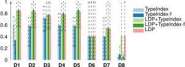

## Evaluation
{:#evaluation}

In this section, we tackle the research question _"How well does link traversal query processing perform over decentralized environments with structural properties"_.
Within this work, we apply our experiments to the structural properties of the decentralized environment provided by Solid,
but findings may be generalizable to other decentralized environments.
We provide an answer to this research question by evaluating different approaches based on the implementation discussed in ,
using a benchmark that simulates Solid data vaults.
We first introduce the design of our experiment,
followed by presenting our experimental results,
and a discussion of our results to answer our research question.

### Experimental Design

Our experimental design is based on an existing benchmark (*name and reference omitted for double-blindness*)
that simulates a realistic decentralized environment based on the Solid ecosystem.
Concretely, the benchmark generates a configurable number of data vaults with configurable sizes containing social networking data,
where a variety of fragmentation strategies are used to organize files in vaults.
Furthermore, it provides SPARQL query templates that simulate a realistic workload for a social networking application.
The underlying dataset and query templates are derived from the [Social Network Benchmark (SNB)](cite:cites ldbc_snb_interactive).

We make use of a factorial experiment containing the following factors and values:

- **Vault discovery**: None, LDP, Type Index, Filtered Type Index, LDP and Type Index, LDP and Filtered Type Index
- **Reachability semantics**: cNone, cMatch, cAll

The LDP strategy corresponds to the disjunction of the source selectors $$\sigma_{\text{SolidVault}}$$ and $$\sigma_{\text{LdpContainer}}$$,
the Type Index to $$\sigma_{\text{LdpContainer}}$$ and $$\sigma_{\text{SolidTypeIndex}}$$ with $$\phi(B, c)$$ always returning `true`,
and the Filtered Type Index to $$\sigma_{\text{LdpContainer}}$$ and $$\sigma_{\text{SolidTypeIndex}}$$ with $$\phi_{\text{QueryClass}}$$.

Our experiments were performed on a 64-bit Ubuntu 14.04 machine with a 24-core 2.40 GHz CPU and 128 GB of RAM.
The Solid vaults and query client were executed in isolated Docker containers on dedicated CPU cores with a simulated network.
To foster reproducibility,
the experimental setup, raw results, and processing scripts are available as open-source on [https://github.com/comunica/Experiments-Solid-Link-Traversal](https://github.com/comunica/Experiments-Solid-Link-Traversal).
All queries were configured with a timeout of two minutes, and were executed three times to average metrics over.
Each query template in the benchmark was instantiated five times, which resulted in 40 discover queries and 35 short queries.

We were unable to compare our implementation to existing LTQP engines,
because those systems (e.g. [Lidaq](cite:cites comparingsummaries)) would either require significant changes to work over Solid vaults,
they depend on a non-standard usage of the SPARQL syntax (e.g. [SPARQL-LD](cite:cites sparqlld)),
or insufficient documentation was present to make them work (e.g. [SQUIN](cite:cites squin)).
Nevertheless, in order to ensure a fair and complete comparison,
we have re-implemented the foundational LTQP algorithms (cNone, cMatch, cAll),
and compare them against, and in combination with, our algorithms.

### Experimental Results

In this section, we present results that offer insights into our research question.
 and 
show the aggregated results for the different combinations of our setup
for the discover and short queries of the benchmark, respectively.
We omit results from complex queries, as none of the approaches achieve a level of accuracy significantly higher than 0%.
Furthermore,  shows the aggregated results of all discover queries over different fragmentation strategies with different post multiplication factors.
Concretely, each table shows the average ($$\overline{t}$$) and median ($$\tilde{t}$$) execution times (ms), the average ($$\overline{t}_1$$) and median ($$\tilde{t}_1$$) time until first result (ms), average number of HTTP requests per query ($$\overline{req}$$), total number of results on average per query ($$\sum ans$$), average accuracy ($$\overline{acc}$$), and number of timeouts ($$\sum to$$) across all queries. The combinations with the highest accuracy value are marked in bold.
The number of HTTP requests is counted across all query executions that did not time out within each combination.
The timeout column represents the number of query templates that lead to a timeout for a given combination.
The accuracy of each query execution is a percentage indicating the precision and recall of query results to the expected results.

<figure id="results-queries-discover" markdown="1" class="table table-smaller-font">

|  | $$\overline{t}$$ | $$\tilde{t}$$ | $$\overline{t}_1$$ | $$\tilde{t}_1$$ | $$\overline{req}$$ | $$\sum ans$$ | $$\overline{acc}$$ | $$\sum to$$ |
| --- | ---: | ---: | ---: | ---: | ---: | ---: | ---: | ---: |
| cnone-base | 40 | 0 | N/A | N/A | 8 | 0.00 | 0.00% | 0 |
| cmatch-base | 1,791 | 0 | 22,946 | 24,439 | 1,275 | 0.00 | 0.00% | 1 |
| call-base | 128,320 | 127,021 | 28,448 | 10,554 | 0 | 0.63 | 3.13% | 8 |
| cnone-idx | 1,448 | 842 | 447 | 351 | 243 | 20.50 | 74.14% | 0 |
| **cmatch-idx** | **12,284** | **2,210** | **2,304** | **1,217** | **2,567** | **39.13** | **99.14%** | **0** |
| call-idx | 124,197 | 124,811 | 48,223 | 9,778 | 18,022 | 3.13 | 17.40% | 7 |
| cnone-idx-filt | 1,429 | 755 | 435 | 311 | 230 | 20.50 | 74.14% | 0 |
| **cmatch-idx-filt** | **12,114** | **2,312** | **2,397** | **1,075** | **2,554** | **39.13** | **99.14%** | **0** |
| call-idx-filt | 124,003 | 126,093 | 43,147 | 29,937 | 11,023 | 4.50 | 29.78% | 8 |
| cnone-ldp | 1,606 | 994 | 563 | 386 | 342 | 20.50 | 74.14% | 0 |
| cmatch-ldp | 13,463 | 2,288 | 3,660 | 1,057 | 3,625 | 37.88 | 86.64% | 1 |
| call-ldp | 123,712 | 123,479 | 37,083 | 13,733 | 0 | 2.00 | 16.25% | 8 |
| cnone-ldp-idx | 1,560 | 1,001 | 482 | 349 | 358 | 20.50 | 74.14% | 0 |
| **cmatch-ldp-idx** | **12,417** | **2,529** | **2,333** | **1,189** | **2,709** | **39.13** | **99.14%** | **0** |
| call-ldp-idx | 127,768 | 125,103 | 67,577 | 13,472 | 12,466 | 2.38 | 16.63% | 7 |
| cnone-ldp-idx-filt | 1,552 | 1,006 | 425 | 331 | 357 | 20.50 | 74.14% | 0 |
| **cmatch-ldp-idx-filt** | **12,483** | **2,372** | **2,309** | **925** | **2,708** | **39.13** | **99.14%** | **0** |
| call-ldp-idx-filt | 123,979 | 125,235 | 48,382 | 10,368 | 16,623 | 3.13 | 17.40% | 7 |

<figcaption markdown="block">
Aggregated results for the different combinations across 8 **discover** queries.
</figcaption>
</figure>

<figure id="results-queries-short" markdown="1" class="table table-smaller-font">

|  | $$\overline{t}$$ | $$\tilde{t}$$ | $$\overline{t}_1$$ | $$\tilde{t}_1$$ | $$\overline{req}$$ | $$\sum ans$$ | $$\overline{acc}$$ | $$\sum to$$ |
| --- | ---: | ---: | ---: | ---: | ---: | ---: | ---: | ---: |
| cnone-base | 34,364 | 70 | 18 | 2 | 12 | 0.14 | 14.29% | 2 |
| cmatch-base | 47,700 | 987 | 121 | 92 | 592 | 0.43 | 42.86% | 3 |
| call-base | 126,794 | 125,609 | 1,547 | 787 | 0 | 0.00 | 0.00% | 7 |
| cnone-idx | 34,775 | 540 | 676 | 151 | 71 | 0.14 | 14.29% | 2 |
| cmatch-idx | 70,142 | 119,114 | 6,837 | 530 | 263 | 0.43 | 42.86% | 4 |
| call-idx | 109,943 | 123,227 | 14,290 | 19,345 | 0 | 0.00 | 0.00% | 7 |
| cnone-idx-filt | 34,804 | 534 | 527 | 110 | 71 | 0.14 | 14.29% | 2 |
| cmatch-idx-filt | 69,808 | 119,032 | 7,190 | 434 | 263 | 0.43 | 42.86% | 4 |
| call-idx-filt | 116,618 | 123,312 | 9,764 | 6,207 | 0 | 0.00 | 0.00% | 7 |
| cnone-ldp | 34,975 | 621 | 816 | 46 | 96 | 0.29 | 15.71% | 2 |
| **cmatch-ldp** | **70,026** | **119,586** | **6,524** | **636** | **291** | **0.57** | **44.29%** | **4** |
| call-ldp | 127,550 | 126,587 | 717 | 483 | 0 | 0.00 | 0.00% | 7 |
| cnone-ldp-idx | 34,852 | 811 | 521 | 43 | 100 | 0.14 | 14.29% | 2 |
| cmatch-ldp-idx | 69,534 | 119,215 | 2,936 | 437 | 295 | 0.43 | 42.86% | 4 |
| call-ldp-idx | 110,217 | 122,525 | 8,841 | 6,114 | 0 | 0.00 | 0.00% | 7 |
| cnone-ldp-idx-filt | 34,830 | 742 | 402 | 83 | 100 | 0.14 | 14.29% | 2 |
| **cmatch-ldp-idx-filt** | **70,042** | **119,126** | **6,246** | **663** | **295** | **0.57** | **44.29%** | **4** |
| call-ldp-idx-filt | 114,800 | 123,058 | 15,075 | 17,192 | 0 | 0.00 | 0.00% | 7 |

<figcaption markdown="block">
Aggregated results for the different combinations across 7 **short** queries.
</figcaption>
</figure>

These results show that there are combinations of approaches that achieve a very high level of accuracy for discover queries,
and an average level of accuracy for short queries.
We will elaborate on these results in more detail hereafter.

### Discussion

#### Intra-vault and inter-vault data discovery

The results above show that if we desire accurate results,
that the combination of cMatch semantics together with at least one of the data vault discovery methods is required.
This combination is needed because our workload contains queries that either target data within a single vault (e.g. D1),
or data spanning multiple data vaults (e.g. D8).
While the different data vault discovery methods are able to discover data *within* vaults,
the reachability of cMatch is required to discover data *across* multiple vaults.

Due to this, cNone (follow no links) is an ineffective replacement for cMatch (follow links matching query) even when combined with discovery methods,
because link traversal across multiple vaults will not take place, which will lead to too few query results.
Concretely, for discover queries cNone can only achieve a accuracy of 74.14% for discover queries and 28.57% for short queries,
compared to respectively 99.14% and 42.86% for cMatch.
However, for those queries that target a single vault, cNone can be used instead of cMatch without a loss of accuracy,
leading to a lower number of HTTP requests and lower query execution times.

Since cAll leads to all links being followed, including those followed by cMatch,
it is theoretically a sufficient replacement for cMatch.
However, our results show that cAll follows too many links, which leads to timeouts for nearly all queries.

Our results show that solely using reachability semantics (cMatch or cAll) without a data discovery method is insufficient for discover queries,
where a accuracy of only up to 3.13% can be achieved for discover queries.
However, when looking at the short queries category, solely using reachability semantics appears to be sufficient,
with the query execution time even being lower.
This difference exists because the discover workload contains queries that discover data related to a certain person or resource,
while the short queries target only details of specific resources. 
Discover queries therefore depend on an overview of the vault, while short queries only depend on specific links between resources within a vault.
The remainder of this discussion only focuses on discover queries, since these achieve the highest level of accuracy.
As such, the short queries highlight opportunities for improvement in future work.

#### Type index and LDP discovery perform similarly

<figure id="figure-queries_indexvsstorage">

<figure id="figure-queries_indexvsstorage_time_relative" class="subfigure">

<figcaption markdown="block">
Execution times.
</figcaption>
</figure>

<figure id="figure-queries_indexvsstorage_http_relative" class="subfigure">

<figcaption markdown="block">
Number of HTTP requests.
</figcaption>
</figure>

<figcaption markdown="block">
Relative measurements for discover queries with different discovery methods under cMatch.
Bars indicate average values, whiskers indicate the maxima and minima,
and stars indicate average time until first result.
</figcaption>
</figure>

When comparing the number of HTTP requests and query execution times for different data vault discovery approaches under cMatch in ,
we can observe that using the type index leads to fewer HTTP requests and faster query execution compared to LDP-based discovery on average.
To explain this behaviour in more detail,  shows the average query execution times of each discover query separately,
for the different combinations of data vault discovery approaches.
To simplify comparability, the execution times within this figure are [relative to the maximum query execution time per query](cite:cites linktraversaloptimization).
Furthermore,  shows the average number of HTTP requests for each of those discover queries,
which are also made relative to the maximum number of requests per query for better comparability.

While  shows that for all queries
using just the type index is slightly faster or comparable to just LDP-based discovery,
this difference has no statistical significance (*p = 0.40*).
However,  shows that the number of HTTP requests with the type index is always significantly lower than via LDP (*p = 0.01*).

When the filter-enabled type index approach is used, five queries (D1, D3, D5, D6, D7) are made even faster compared to the non-filtered type index approach.
This is because those queries target a possibly empty subset of the type index entries,
which means that a significant range of links can be pruned out,
which leads to a major reduction in the number of HTTP requests,
which is a main bottleneck in link traversal.
For the other queries, the filter-enabled approach becomes slightly slower than (D2, D4) or is comparable to (D8) the non-filtered type index approach.
For those queries, the processing overhead of type index filtering becomes too high compared to its potential benefit.
Statistically, this difference has no significance in terms of execution time (*p = 0.69*) and number of HTTP requests (*p = 0.68*).

These results show that using the type index together with LDP-based discovery is not *significantly* better than the other approaches (*p = 0.71*),
which is primarily caused by the statistically significantly higher number of HTTP requests (*p = 0.02*)
required for traversing both the type index and nested LDP containers.
Query D8 does however show that this combination deserves further investigation,
because this query has a result limit that leads to a prioritization of links via the type index,
leading to earlier query termination with fewer requests.

In general, results hint that the LDP-based approach combined with filtered type index approach performs better than the other approaches,
but this difference is too minor to be significant,
hence all approaches can be considered equivalent.

#### Zero-knowledge query planning is ineffective

While it may seem obvious to assume that higher query execution times are caused by a higher number of links that need to be dereferenced,
we observe only a weak correlation (*$$\rho$$ = 0.32*) of this within the cMatch-based discovery approaches discussed before.
The main bottleneck in this case appears not primarily to be the number of links to traverse.
Instead, our analysis suggests that query plan efficiency is the primary influencer of execution times.

<figure id="results-planning-effectiveness" class="table" class="table-smaller-font" markdown="1">

| Query | Integrated | Two-phase | HTTP Requests |
| --- | --: | --: | --: |
| D1 | 1,077.58 | 403.54 | 222 |
| D2 | 1,020.67 | 567.57 | 223 |
| D3 | 1,193.01 | 821.23 | 429 |
| D4 | 3,266.62 | 505.00 | 228 |
| D5 | 522.23 | 387.24 | 223 |
| D6 | 710.16 | 289.72 | 122 |
| D7 | 626.96 | 340.54 | 122 |
| D8 | 2,037.85 | 1,654.02 | 420 |

<figcaption markdown="block">
Integrated and two-phase execution times (ms) of discover queries, with number of HTTP requests per query.
</figcaption>
</figure>

To empirically prove this finding, we compare the execution times of our default integrated query execution approach (cMatch with filtered type index discovery)
with a two-phase query execution approach that we implemented in the same query engine.
Instead of following links during query execution as in the integrated approach,
the two-phase approach first follows links to index all discovered triples,
and processes the query in the traditional *optimize-then-execute* manner.
This two-phase approach is based on an oracle that provides all query-relevant links, which we determined by analyzing the request logs during the execution of the integrated approach.
Therefore, this two-phase approach is merely a theoretical case,
which delays time until first results due to prior indexing,
and which may not always be achievable due to infinitely growing link queues for some queries.
The results of this are shown in .

These results show that the two-phase approach is on average two times faster for all queries compared to the integrated approach,
even when taking into account time for dereferencing.
The reason for this is that the two-phase approach is able to perform [traditional query planning](cite:cites sparqlqueryoptimization, sparqlbgpoptimization),
since it has access to an indexed triple store with planning-relevant information such as cardinality estimates.
Since the integrated approach finds new triples _during_ query execution,
it is unable to use them for traditional planning.
Instead, our integrated approach makes use of the [zero-knowledge query planning technique](cite:cites zeroknowldgequeryplanning)
that uses heuristics to plan the query before execution.

Since the only difference between the implementations of the integrated and two-phase approach is in how they plan the query,
we can derive the query plan of the integrated approach is very ineffective.
As such, there is clear need for better query planning during integrated execution,
and the two-phase approach shows that performance could become more than two times better.

[Zero-knowledge query planning](cite:cites zeroknowldgequeryplanning) is ineffective in our experiments
because it has been designed under the assumptions of Linked Open Data,
while it does not match with the structural assumptions of specific decentralized environments such as Solid.
For example, one of the heuristics within this planner deprioritizes triple patterns with vocabulary terms, such as `rdf:type`,
since they are usually the least selective.
However, when a Solid type index is present, such vocabulary terms may instead become _very selective_,
which means that those would benefit from prioritization.
As such, there is a need for alternative query planners that consider the structural assumptions within specific decentralized environments.
