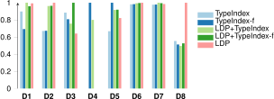
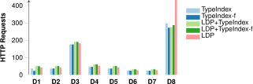

## Evaluation
{:#evaluation}

In this section, we tackle the research question _"How well does link traversal query processing perform over decentralized environments with structural properties"_.
Within this work, we apply this to the structural properties of the decentralized environment provided by Solid,
but findings may be generalizable to other decentralized environments.
We provide an answer to this research question by simulating Solid data vaults using the benchmark introduced in  using the default configuration,
and evaluating different approaches based on the implementation discussed in .
We first introduce the design of our experiment,
followed by presenting our experimental results,
and a discussion of our results to answer our research question.

<!-- This is a dummy placeholder -->

### Experimental Design

We make use of a full factorial experiment containing the following factors and values:

- **Vault discovery**: None, LDP, Type Index, Filtered Type Index, LDP and Type Index, LDP and Filtered Type Index
- **Reachability semantics**: cNone, cMatch, cAll

The LDP strategy corresponds to the disjunction of the source selectors $$\sigma_{\text{SolidVault}}$$ and $$\sigma_{\text{LdpContainer}}$$,
the Type Index to $$\sigma_{\text{LdpContainer}}$$ and $$\sigma_{\text{SolidTypeIndex}}$$ with $$\phi(B, c)$$ always returning `true`,
and the Filtered Type Index to $$\sigma_{\text{LdpContainer}}$$ and $$\sigma_{\text{SolidTypeIndex}}$$ with $$\phi_{\text{QueryClass}}$$,

Our experiments were performed on a 64-bit Ubuntu 14.04 machine with a 24-core 2.40 GHz CPU and 128 GB of RAM.
The Solid vaults and query client were executed in isolated Docker containers on dedicated CPU cores with a simulated network.
To foster reproducibility,
the experimental setup, raw results, and processing scripts are available as open-source on [https://anonymous.4open.science/r/webconf-2023-querysolid-experiments/](https://anonymous.4open.science/r/webconf-2023-querysolid-experiments/).
All queries were configured with a timeout of two minutes, and were executed three times to average metrics over.
Each query template in the benchmark was instantiated five times, which resulted in 40 discover queries, 35 short queries, and 60 complex queries.

### Experimental Results

<figure id="results-queries-discover" class="table" markdown="1" class="table-smaller-font">

|  | $$\overline{t}$$ | $$\tilde{t}$$ | $$\overline{t}_1$$ | $$\tilde{t}_1$$ | $$\overline{req}$$ | $$\sum ans$$ | $$\overline{cor}$$ | $$\sum to$$ |
| --- | ---: | ---: | ---: | ---: | ---: | ---: | ---: | ---: |
| cnone-base | 43 | 0 | N/A | N/A | 8 | 0.00 | 0.00% | 0 |
| cmatch-base | 4,658 | 0 | 32,846 | 31,615 | 437 | 1.25 | 12.50% | 0 |
| call-base | 83,734 | 118,813 | 34,808 | 34,360 | 446 | 2.88 | 20.63% | 7 |
| cnone-idx | 2,040 | 674 | 762 | 634 | 291 | 20.50 | 74.14% | 0 |
| **cmatch-idx** | **16,529** | **1,867** | **3,483** | **973** | **664** | **39.13** | **99.14%** | **0** |
| call-idx | 80,597 | 118,512 | 28,240 | 26,950 | 478 | 3.63 | 24.38% | 7 |
| cnone-idx-filt | 1,926 | 644 | 696 | 703 | 278 | 20.50 | 74.14% | 0 |
| **cmatch-idx-filt** | **16,253** | **1,504** | **3,287** | **933** | **631** | **39.13** | **99.14%** | **0** |
| call-idx-filt | 80,439 | 118,433 | 29,193 | 31,133 | 482 | 3.50 | 23.75% | 7 |
| cnone-ldp | 2,431 | 794 | 916 | 895 | 342 | 20.50 | 74.14% | 0 |
| **cmatch-ldp** | **19,113** | **2,452** | **5,356** | **1,496** | **831** | **39.13** | **99.14%** | **0** |
| call-ldp | 83,691 | 118,740 | 35,220 | 35,439 | 442 | 2.88 | 20.63% | 7 |
| cnone-ldp-idx | 2,844 | 1,072 | 971 | 1,005 | 406 | 20.50 | 74.14% | 0 |
| **cmatch-ldp-idx** | **17,026** | **3,108** | **3,476** | **1,575** | **733** | **39.13** | **99.14%** | **0** |
| call-ldp-idx | 80,234 | 118,352 | 27,841 | 29,887 | 476 | 3.63 | 24.38% | 7 |
| cnone-ldp-idx-filt | 2,879 | 1,017 | 1,073 | 976 | 405 | 20.50 | 74.14% | 0 |
| **cmatch-ldp-idx-filt** | **16,903** | **2,241** | **3,493** | **1,429** | **750** | **39.13** | **99.14%** | **0** |
| call-ldp-idx-filt | 80,228 | 118,218 | 27,069 | 29,430 | 467 | 3.63 | 24.38% | 7 |

<figcaption markdown="block">
Aggregated results for the different combinations across all 8 **discover** queries.
</figcaption>
</figure>

<figure id="results-queries-short" class="table" markdown="1" class="table-smaller-font">

|  | $$\overline{t}$$ | $$\tilde{t}$$ | $$\overline{t}_1$$ | $$\tilde{t}_1$$ | $$\overline{req}$$ | $$\sum ans$$ | $$\overline{cor}$$ | $$\sum to$$ |
| --- | ---: | ---: | ---: | ---: | ---: | ---: | ---: | ---: |
| cnone-base | 80 | 5 | 0 | 0 | 15 | 0.14 | 14.29% | 0 |
| **cmatch-base** | **27,429** | **197** | **190** | **64** | **596** | **0.43** | **42.86%** | **2** |
| call-base | 119,280 | 118,717 | 6,008 | 1,305 | 0 | 0.29 | 28.57% | 7 |
| cnone-idx | 2,023 | 75 | 855 | 861 | 121 | 1.57 | 28.57% | 0 |
| **cmatch-idx** | **69,039** | **118,412** | **1,095** | **202** | **275** | **0.43** | **42.86%** | **4** |
| call-idx | 119,521 | 118,937 | 2,586 | 828 | 0 | 0.29 | 28.57% | 7 |
| cnone-idx-filt | 1,995 | 64 | 827 | 866 | 121 | 1.57 | 28.57% | 0 |
| **cmatch-idx-filt** | **68,785** | **117,814** | **1,128** | **362** | **275** | **0.43** | **42.86%** | **4** |
| call-idx-filt | 119,699 | 118,765 | 2,007 | 1,099 | 0 | 0.29 | 28.57% | 7 |
| cnone-ldp | 2,372 | 79 | 1,274 | 1,194 | 140 | 1.57 | 28.57% | 0 |
| **cmatch-ldp** | **69,403** | **118,999** | **1,012** | **92** | **291** | **0.43** | **42.86%** | **4** |
| call-ldp | 119,237 | 118,749 | 6,400 | 6,798 | 0 | 0.29 | 28.57% | 7 |
| cnone-ldp-idx | 2,784 | 71 | 1,247 | 1,224 | 164 | 1.57 | 28.57% | 0 |
| **cmatch-ldp-idx** | **68,973** | **117,888** | **1,219** | **617** | **307** | **0.43** | **42.86%** | **4** |
| call-ldp-idx | 119,196 | 118,906 | 3,823 | 914 | 0 | 0.29 | 28.57% | 7 |
| cnone-ldp-idx-filt | 2,833 | 109 | 1,247 | 1,167 | 164 | 1.57 | 28.57% | 0 |
| **cmatch-ldp-idx-filt** | **69,138** | **118,235** | **1,228** | **388** | **307** | **0.43** | **42.86%** | **4** |
| call-ldp-idx-filt | 119,599 | 118,820 | 3,580 | 396 | 0 | 0.29 | 28.57% | 7 |

<figcaption markdown="block">
Aggregated results for the different combinations across all 7 **short** queries.
</figcaption>
</figure>

In this section, we present results that offer insights into our research question.
 and 
show the aggregated results for the different combinations of our setup
for the discover and short queries of the benchmark, respectively.
Since the results for the complex queries don't add any value to this article, they have been moved into the [appendix](#appendix-evaluation).
Concretely, each table shows the average ($$\overline{t}$$) and median ($$\tilde{t}$$) execution times (ms), the average ($$\overline{t}_1$$) and median ($$\tilde{t}_1$$) time until first result (ms), average number of HTTP requests per query ($$\overline{req}$$), total number of results on average per query ($$\sum ans$$), average correctness ($$\overline{cor}$$), and number of timeouts ($$\sum to$$) across all queries. The combinations with the highest correctness value are marked in bold.
The number of HTTP requests is counted across all query executions that did not time out within each combination.
The timeout column represents the number of query templates that lead to a timeout for a given combination.
The correctness of each query execution is calculated as the percentage of expected results that were actually produced.

These results show that there are combinations of approaches that achieve a very high level of correctness for discover queries,
and an average level of correctness for short queries.
However, for complex queries, none of the combinations achieve an acceptable level of correctness.
Hence, we consider this last query category too complex for current link traversal approaches, and we do not consider them further in this article.

### Discussion

#### Intra-vault and inter-vault data discovery

The results above show that if we desire correct results,
that the combination of cMatch semantics together with at least one of the data vault discovery methods is required.
This combination is needed because our workload contains queries that either target data within a single vault (e.g. D1),
or data spanning multiple data vaults (e.g. D8).
While the different data vault discovery methods are able to discover data *within* vaults,
the reachability of cMatch is required to discover data *across* multiple vaults.

Due to this, cNone (follow no links) is an ineffective replacement for cMatch (follow links matching query) even when combined with discovery methods,
because link traversal across multiple vaults will not take place, which will lead to too few query results.
Concretely, for discover queries cNone can only achieve a completeness of 74.14% for discover queries and 28.57% for short queries,
compared to respectively 99.14% and 42.86% for cMatch.
However, for those queries that target a single vault, cNone can be used instead of cMatch without a loss of correctness,
leading to a lower number of HTTP requests and lower query execution times.

Since cAll leads to all links being followed, including those followed by cMatch,
it is theoretically a sufficient replacement for cMatch.
However, our results show that too many links are being followed, which leads to timeouts for nearly all queries.

Our results show that solely using reachability semantics (cMatch or cAll) without a data discovery method is insufficient for discover queries,
where a completeness of only up to 12.50% or 19.38% can be achieved.
However, when looking at the short queries category, solely using reachability semantics appears to be sufficient,
with the number of HTTP requests and query execution time even being lower.
This difference exists because the discover workload contains queries that discover data related to a certain person or resource,
while the short queries target only details of specific resources. 
Discover queries therefore depend on an overview of the vault, while short queries only depend on specific links between resources within a vault.
The remainder of this discussion only focuses on discover queries, since these achieve the highest level of correctness.
As such, the short and complex queries highlight opportunities for improvement in future work.

#### Type index and LDP discovery perform similarly

When comparing the number of HTTP requests and query execution times for different data vault discovery approaches under cMatch in ,
we can observe that using the type index leads to fewer HTTP requests and faster query execution compared to LDP-based discovery on average.
To explain this behaviour in more detail,  shows the average query execution times of each discover query separately,
for the different combinations of data vault discovery approaches.
To simplify comparability, the execution times within this figure are [relative to the maximum query execution time per query](cite:cites linktraversaloptimization).
The [appendix](#appendix-evaluation) contains more detailed query result arrival times for several of these queries using [diefficiency plots](cite:cites diefficiency).
Furthermore,  shows the average number of HTTP requests for each of those discover queries.

<figure id="figure-queries_indexvsstorage_time_relative">

<figcaption markdown="block">
Relative execution times for discover queries with different discovery methods under cMatch.
Bars indicate average execution time,
whiskers indicate the maxima and minima,
and stars indicate average time until first result.
</figcaption>
</figure>

<figure id="figure-queries_indexvsstorage_http">

<figcaption markdown="block">
Average number of HTTP requests for discover queries with different discovery methods under cMatch.
</figcaption>
</figure>

While  shows that for six queries (D1, D2, D5, D6, D7, D8)
using just the type index is slightly faster or comparable to just LDP-based discovery,
this difference has no statistical significance (*p = 0.55*).
However,  shows that the number of HTTP requests with the type index is always slightly lower than via LDP,
but this only has a very weak statistical significance (*p = 0.12*).

When the filter-enabled type index approach is used, three queries (D1, D3, D8) are made even faster compared to the non-filtered type index approach.
This is because those queries target a possibly empty subset of the type index entries,
which means that a significant range of links can be pruned out,
which leads to a major reduction in the number of HTTP requests,
which is a main bottleneck in link traversal.
However, for two queries (D4, D5), the filter-enabled becomes slower than the non-filtered type index approach.
This is because those queries perform relatively fast across all approaches,
while the processing overhead of type index filtering becomes too high compared to its potential benefit.
Statistically, this difference has no significance in terms of execution time (*p = 0.81*) and number of HTTP requests (*p = 0.68*).

These results show that using the type index together with LDP-based discovery is not beneficial in general,
which is primarily caused by the statistically significantly higher number of HTTP requests (*p = 0.03*)
required for traversing both the type index and nested LDP containers.
Query D8 does however show that this combination deserves further investigation,
because this query has a result limit that leads to a prioritization of links via the type index,
leading to earlier query termination with fewer requests.

In general, these results hint that the filtered type index approach performs better than the other approaches.
However, due to the minimal difference in terms of execution time,
the performance of all approaches can be considered equivalent.

#### Zero-knowledge query planning is ineffective

While it may seem obvious to assume that higher query execution times are caused by a higher number of links that need to be dereferenced,
we observe no significant correlation (*p = 0.76*) of this within the cMatch-based discovery approaches discussed before.
As such, the main bottleneck in this case appears not to be the number of links to traverse.
Instead, our analysis suggests that query plan efficiency is the primary influencer of execution times.

To empirically prove this finding, we compare the execution times of our default integrated query execution approach (cMath with filtered type index discovery)
with a two-phase query execution approach that we implemented in the same query engine.
Instead of following links during query execution as in the integrated approach,
the two-phase approach first follows links to index all discovered triples,
and processes the query in the traditional *optimize-then-execute* manner.
This two-phase approach is based on an oracle that provides all query-relevant links, which we determined by analyzing the request logs during the execution of the integrated approach.
Therefore, this two-phase approach is merely a theoretical case,
which delays time until first results due to prior indexing,
and which may not always be achievable in practise due to infinitely growing link queues for some queries.
The results of this experiment are shown in .

<figure id="results-planning-effectiveness" class="table" markdown="1">

| Query | Integrated | Two-phase | HTTP Requests |
| --- | --: | --: | --: |
| D1 | 5,826.83 | 451.42 | 222 |
| D2 | 6,043.50 | 646.77 | 223 |
| D3 | 7,490.17 | 1,118.69 | 428 |
| D4 | 5,734.25 | 509.56 | 228 |
| D5 | 1,499.62 | 365.76 | 222 |
| D6 | 2,360.60 | 310.79 | 121 |
| D7 | 3,226.30 | 316.05 | 121 |
| D8 | 4,739.88 | 2,292.81 | 217 |

<figcaption markdown="block">
Integrated and two-phase query execution times of discover queries, with number of HTTP requests per query.
</figcaption>
</figure>

These results show that the two-phase approach is an order of magnitude faster for all queries compared to the integrated approach,
even when taking into account time for dereferencing.
The reason for this is that the two-phase approach is able to perform [traditional query planning](cite:cites sparqlqueryoptimization, sparqlbgpoptimization),
since it has access to an indexed triple store with planning-relevant information such as cardinality estimates.
Since the integrated approach finds new triples _during_ query execution,
it is unable to use this information for traditional query planning.
Instead, our integrated approach makes use of the [zero-knowledge query planning technique](cite:cites zeroknowldgequeryplanning)
that makes use of heuristics to plan the query before execution.

Since the only difference between the implementations of the integrated and two-phase approach is in how they plan the query,
we can derive the query plan of the integrated approach is very ineffective.
As such, there is clear need for better query planning during integrated execution,
and the two-phase approach shows that performance could become up to an order of magnitude better.

[Zero-knowledge query planning](cite:cites zeroknowldgequeryplanning) is ineffective in our experiments
because it has been designed under the assumptions of Linked Open Data,
while it does not match with the structural assumptions of specific decentralized environments such as Solid.
For example, one of the heuristics within this planner deprioritizes triple patterns with vocabulary terms, such as `rdf:type`,
since they are usually the least selective.
However, when a Solid type index is present, such vocabulary terms may instead become _very selective_,
which means that those would benefit from prioritization.
As such, there is a need for alternative query planners that consider the structural assumptions within specific decentralized environments.

<!--

#### Live exploration is required for heterogeneous fragmentations

Optional: if time left. (we could also just discuss this in conclusions if not time left)
Show that hardcoded data access to specific files is not good, because different vaults have different frag strategies.
Any findings by comparing different frag strategies?
{:.todo}

-->